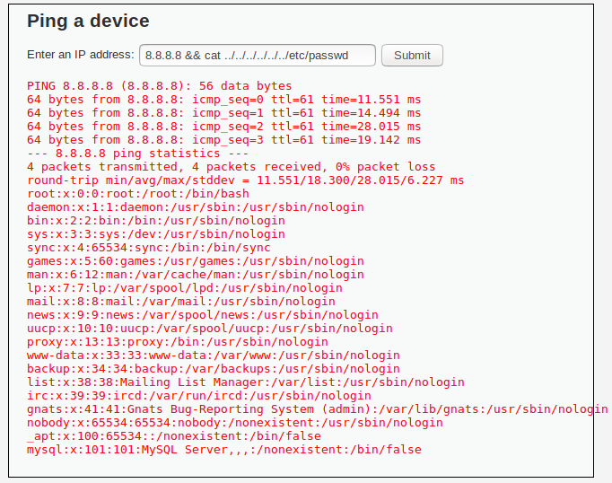
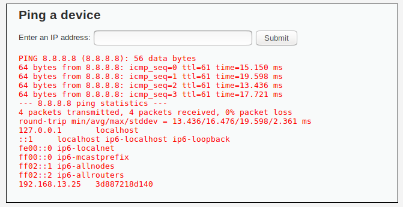

---

### Your Wish is My Command Injection

- Mitigation: Methods to mitigate this attack include only allowing certain characters allowed in the input, for example: numbers and periods could be the only two characters allowed to deter strings and paths to be entered.

### A Brute Force to Be Reckoned With

- After completing a brute force attack using Burp Suite to test breached passwords, I discovered the login information that gained access to BWAPP login page. This was accomplished by intercepting traffic using BurpSuite, sending the intercept to Intruder and using the payloads to test 100 combinations. I knew tonystark succeeded because the string length was greater than the other requests. 

- Mitigation: There are multiple strategies to mitigate this attack. Firstly, using multy factor authentication where there is a separate key independent of the password could prevent this attack. Additionally, requiring complex passwords and a lock out after multiple failed attempts could also help to mitigate this attack. 

### Where's the beEF?

